# 🏡 Smart House Price Prediction

<div align="center">

### An End-to-End Machine Learning House Price Prediction System

Predict residential property prices using Machine Learning, FastAPI, and a modern web interface.


</div>

---

## 📖 Overview

Smart House Price Prediction is an end-to-end Machine Learning project that estimates residential property prices using advanced regression algorithms.

The project covers the complete machine learning lifecycle—from data understanding and preprocessing to model training, evaluation, deployment, and prediction through an interactive web application.

The final deployed system uses a **Gradient Boosting Regressor**, optimized using **GridSearchCV**, achieving an **R² Score of 0.9140** on the test dataset.

---

## 🎯 Objectives

- Build a complete machine learning pipeline for house price prediction.
- Compare multiple regression algorithms.
- Optimize the best-performing model using hyperparameter tuning.
- Develop a reusable preprocessing pipeline.
- Deploy the trained model using FastAPI.
- Provide an intuitive web interface for real-time predictions.

---

## ✨ Key Features

### 📊 Data Processing

- Exploratory Data Analysis (EDA)
- Missing Value Analysis
- Missing Value Imputation
- Feature Engineering
- Feature Scaling
- Categorical Encoding
- Data Validation

### 🤖 Machine Learning

- Multiple Regression Models
- Hyperparameter Tuning using GridSearchCV
- Model Comparison
- Feature Importance Analysis
- Residual Analysis
- Model Serialization

### 🌐 Deployment

- FastAPI REST API
- Interactive Swagger Documentation
- Responsive Frontend
- Real-Time Predictions
- Batch Prediction Support
- Modular Project Structure

---

# 📑 Table of Contents

- [Project Architecture](#-project-architecture)
- [Project Structure](#-project-structure)
- [Technology Stack](#-technology-stack)
- [Dataset](#-dataset)
- [Machine Learning Workflow](#-machine-learning-workflow)
- [Models Used](#-models-used)
- [Model Performance](#-model-performance)
- [Evaluation Results](#-evaluation-results)
- [Application Screenshots](#-application-screenshots)
- [API Documentation](#-api-documentation)
- [Installation](#-installation)
- [Usage](#-usage)
- [Future Improvements](#-future-improvements)
- [License](#-license)

# 🏗️ Project Architecture

The application follows a modular architecture that separates the user interface, backend services, machine learning pipeline, and trained model. This structure makes the project easier to maintain, test, and extend.

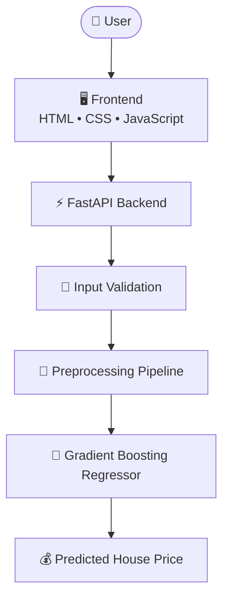

---

# 🧠 Machine Learning Workflow

The machine learning workflow follows the standard lifecycle from raw data to deployment.

```mermaid
flowchart LR

A[Raw Dataset]

B[Exploratory Data Analysis]

C[Data Cleaning]

D[Feature Engineering]

E[Feature Scaling]

F[Model Training]

G[Hyperparameter Tuning]

H[Model Evaluation]

I[Model Serialization]

J[Deployment]

A --> B
B --> C
C --> D
D --> E
E --> F
F --> G
G --> H
H --> I
I --> J
```

---

# 🚀 Deployment Workflow

The deployed application loads the trained model and preprocessing metadata to make real-time predictions.

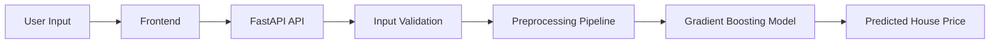

---

# 📂 Project Structure

```text
Smart-House-Price-Prediction/
│
├── backend/
│   ├── api/
│   ├── config/
│   ├── schemas/
│   ├── services/
│   ├── utils/
│   │   └── preprocessing_pipeline.py
│   └── app.py
│
├── data/
│   ├── raw/
│   └── processed/
│
├── evaluation/
│
├── frontend/
│
├── images/
│
├── models/
│   ├── gradient_boosting_tuned.pkl
│   ├── feature_columns.pkl
│   ├── preprocessing_metadata.pkl
│   ├── standard_scaler.pkl
│   ├── scaled_columns.pkl
│   └── excluded_columns.pkl
│
├── notebooks/
│   ├── 01_data_understanding.ipynb
│   ├── 02_data_preprocessing.ipynb
│   ├── 03_model_training.ipynb
│   ├── 04_model_evaluation.ipynb
│   └── 05_Model_Deployment_Preparation.ipynb
│
├── tests/
│
├── README.md
├── requirements.txt
├── LICENSE
└── .gitignore
```

---

# 📁 Directory Description

| Folder | Description |
|---------|-------------|
| **backend/** | FastAPI application and prediction API |
| **data/** | Raw and processed datasets |
| **evaluation/** | Model evaluation plots and reports |
| **frontend/** | HTML, CSS, and JavaScript user interface |
| **images/** | Images and screenshots used in the README |
| **models/** | Saved model and preprocessing artifacts |
| **notebooks/** | End-to-end machine learning workflow |
| **tests/** | Unit and integration tests |

---

# 🛠️ Technology Stack

The project combines modern Machine Learning tools with a lightweight deployment framework.

| Category | Technologies |
|----------|--------------|
| Programming Language | Python 3.12 |
| Machine Learning | Scikit-learn |
| Data Analysis | Pandas, NumPy |
| Data Visualization | Matplotlib |
| Backend Framework | FastAPI |
| Frontend | HTML, CSS, JavaScript |
| Model Serialization | Joblib |
| Development Environment | Jupyter Notebook, VS Code |
| Version Control | Git & GitHub |

---

# 📊 Dataset

The project uses the **Ames Housing Dataset**, a widely used regression dataset for predicting residential property prices.

### Dataset Characteristics

- Number of Samples: **1460**
- Numerical Features: **38**
- Categorical Features: **43**
- Target Variable: **SalePrice**

The dataset contains information about:

- Property Size
- Overall Quality
- Year Built
- Garage Details
- Basement Information
- Exterior Features
- Neighborhood Characteristics
- Lot Dimensions
- Interior Rooms

These features collectively help estimate the selling price of residential houses.

---

# ⚙️ Data Preprocessing Pipeline

Before training the machine learning models, the dataset undergoes a comprehensive preprocessing pipeline.

## Steps Performed

### 1. Data Understanding

- Dataset inspection
- Data types analysis
- Missing value identification
- Duplicate record detection
- Statistical summary

---

### 2. Missing Value Handling

Different strategies were applied depending on the feature characteristics.

- Median Imputation
- Mode Imputation
- Constant Value Imputation
- Category-specific handling

---

### 3. Feature Engineering

- Numerical feature processing
- Categorical encoding
- Feature selection
- Removal of unnecessary columns

---

### 4. Feature Scaling

Numerical features were standardized before model training to improve learning consistency where applicable.

---

### 5. Deployment Pipeline

The same preprocessing steps are reused during inference using a dedicated preprocessing pipeline to ensure consistency between training and prediction.

---

# 🤖 Machine Learning Models

Multiple regression algorithms were trained and compared.

| Model | Purpose |
|--------|---------|
| Linear Regression | Baseline model |
| Ridge Regression | L2 Regularization |
| Lasso Regression | L1 Regularization |
| Random Forest Regressor | Ensemble Learning |
| **Gradient Boosting Regressor** | Final Selected Model |

The models were evaluated using identical preprocessing steps and regression metrics to ensure a fair comparison.

---

# 🎯 Hyperparameter Tuning

The best-performing model (**Gradient Boosting Regressor**) was further optimized using **GridSearchCV**.

### Best Parameters

| Parameter | Value |
|-----------|-------|
| Learning Rate | 0.05 |
| Number of Estimators | 300 |
| Maximum Depth | 5 |
| Subsample | 0.8 |

The tuning process used **5-fold Cross Validation** to improve model generalization.

---

# 📈 Model Performance

After evaluating multiple regression algorithms, the **Gradient Boosting Regressor** was selected as the final model due to its superior predictive performance and strong generalization capability.

## 🏆 Final Model

> **Gradient Boosting Regressor (Tuned using GridSearchCV)**

---

## 📊 Performance Metrics

| Metric | Value |
|---------|-------:|
| **R² Score** | **0.9140** |
| **Cross Validation Mean** | **0.8761** |
| **Cross Validation Standard Deviation** | **0.0448** |
| **Mean Absolute Error (MAE)** | **15,737.35** |
| **Mean Squared Error (MSE)** | **659,500,022.11** |
| **Root Mean Squared Error (RMSE)** | **25,680.73** |
| **Training Time** | **4.22 seconds** |
| **Prediction Time** | **0.019 seconds** |

---

## 📌 Performance Interpretation

The tuned Gradient Boosting model achieved an **R² Score of 0.9140**, indicating that the model explains approximately **91.4% of the variance** in house prices.

The **Cross Validation Mean of 0.8761** with a **standard deviation of 0.0448** suggests that the model generalizes well across different data splits and maintains stable performance.

The relatively low **MAE** and **RMSE** indicate that prediction errors remain within an acceptable range for this regression problem.

---

# 📊 Evaluation Results

The model was evaluated using several visualization techniques to better understand its prediction quality and error characteristics.

---

## 📍 Actual vs Predicted

This visualization compares the predicted house prices with the actual selling prices.

<p align="center">
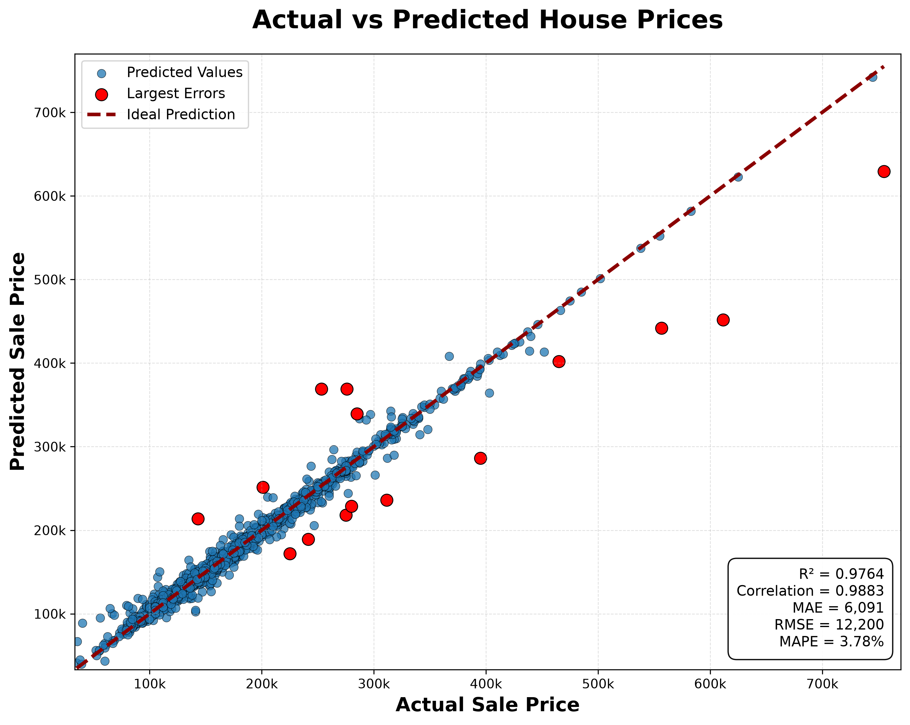
</p>

**Observation**

- Predictions closely follow the actual values.
- Most data points lie near the ideal prediction line.
- Indicates strong predictive performance.

---

## 📍 Feature Importance

Feature Importance identifies which features contribute the most to the prediction.

<p align="center">
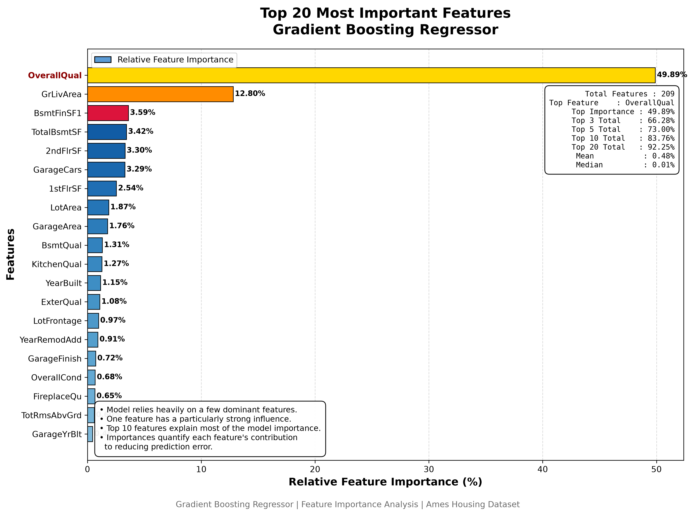
</p>

**Observation**

- Highlights the most influential housing features.
- Improves model interpretability.
- Helps understand the factors affecting house prices.

---

## 📍 Permutation Importance

Permutation Importance measures the impact of each feature by observing the performance drop after random shuffling.

<p align="center">
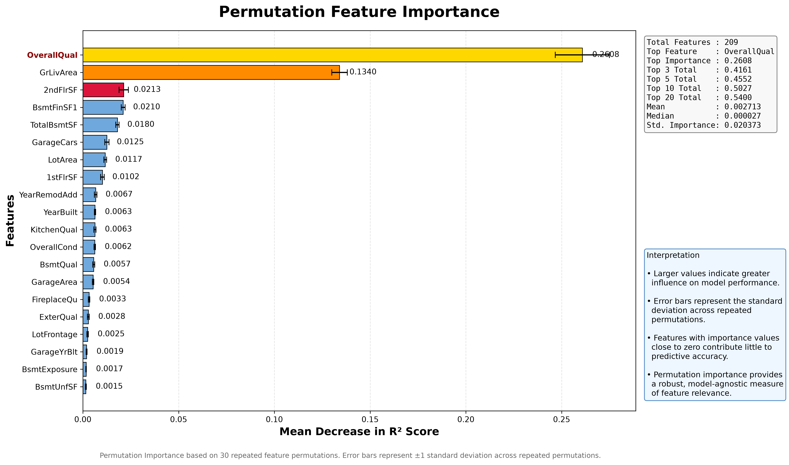
</p>

**Observation**

- Confirms important predictive features.
- Provides model-agnostic interpretability.
- Complements traditional feature importance.

---

## 📍 Residual Distribution

Residual analysis helps determine whether prediction errors are randomly distributed.

<p align="center">
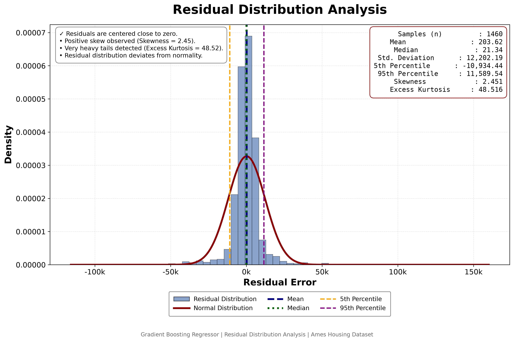
</p>

**Observation**

- Residuals are approximately centered around zero.
- No major systematic bias is observed.
- Indicates balanced prediction errors.

---

## 📍 Residual vs Predicted

Residual plots help identify heteroscedasticity or systematic prediction errors.

<p align="center">
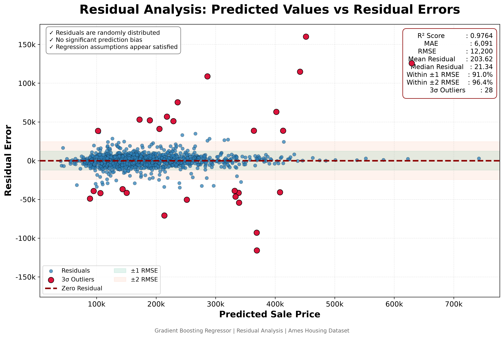
</p>

**Observation**

- Residuals are randomly scattered.
- No strong visible pattern.
- Suggests the regression assumptions are reasonably satisfied.

---

## 📍 QQ Plot

The QQ Plot evaluates whether residuals approximately follow a normal distribution.

<p align="center">
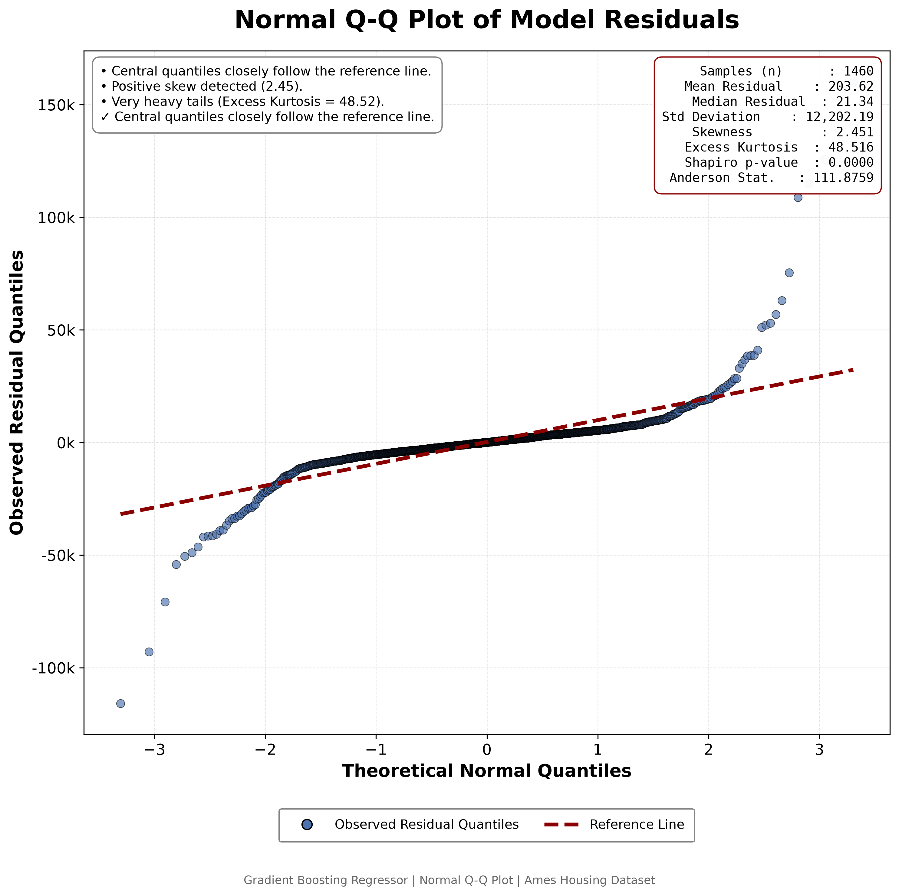
</p>

**Observation**

- Most residuals align closely with the reference line.
- Minor deviations at the extremes are expected.
- Supports the overall quality of the regression model.

---

# ✅ Conclusion

Based on quantitative metrics and qualitative evaluation:

- High predictive accuracy (**R² = 0.9140**)
- Stable cross-validation performance
- Low prediction error
- Well-behaved residuals
- Consistent feature importance analysis

The tuned **Gradient Boosting Regressor** was selected as the final deployment model because it provided the best balance between predictive accuracy, robustness, and generalization.

# 📷 Application Screenshots

The application provides a simple and intuitive web interface for predicting residential house prices.

---

## 🏠 Home Page

Users can enter property details through an interactive web form.

<p align="center">
    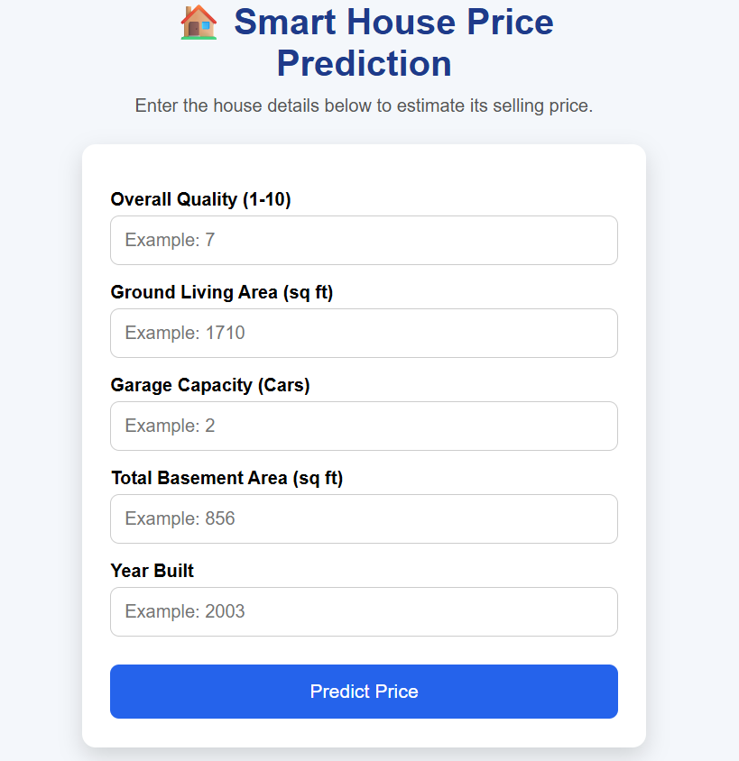
</p>

---

## 💰 Prediction Result

After submitting the property details, the application instantly predicts the estimated house price.

<p align="center">
    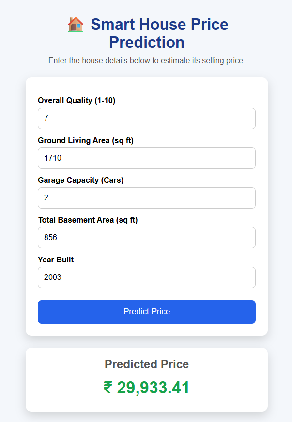
</p>

---

## 🌐 Swagger API Documentation

FastAPI automatically generates interactive API documentation, making it easy to test endpoints directly from the browser.

<p align="center">
    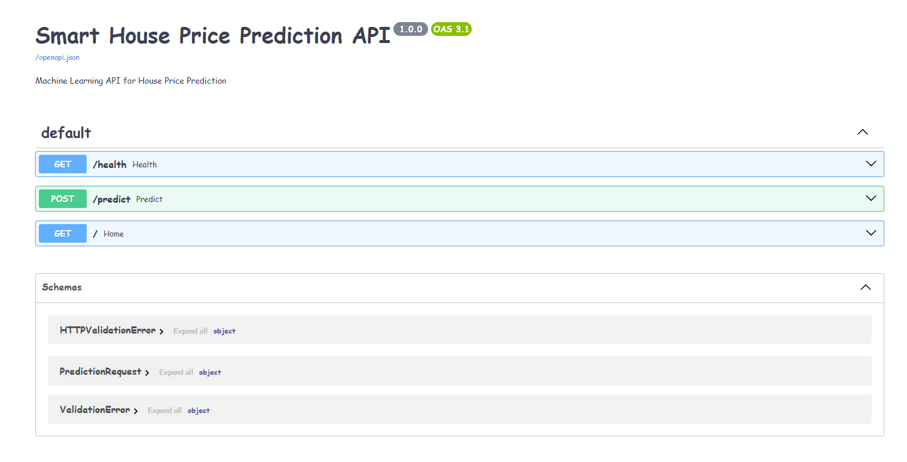
</p>

---

# 🌐 API Documentation

The backend is implemented using **FastAPI**, exposing RESTful endpoints for prediction.

## Base URL

```
http://127.0.0.1:8000
```

---

## Predict House Price

**Endpoint**

```
POST /predict
```

### Sample Request

```json
{
  "OverallQual": 7,
  "GrLivArea": 1710,
  "GarageCars": 2,
  "GarageArea": 548,
  "TotalBsmtSF": 856,
  "FullBath": 2,
  "YearBuilt": 2003,
  "YearRemodAdd": 2003
}
```

### Sample Response

```json
{
    "predicted_price": 208945.37
}
```

---

## Interactive Documentation

Run the application and open:

```
http://127.0.0.1:8000/docs
```

---

# 🚀 Installation

## Clone Repository

```bash
git clone https://github.com/Vedansh1011/Smart-House-Price-Prediction.gitcd

cd Smart-House-Price-Prediction
```

---

## Create Virtual Environment

### Windows

```bash
python -m venv venv

venv\Scripts\activate
```

### Linux / macOS

```bash
python3 -m venv venv

source venv/bin/activate
```

---

## Install Dependencies

```bash
pip install -r requirements.txt
```

---

## Run FastAPI

```bash
uvicorn backend.app:app --reload
```

---

## Open the Application

Frontend

```
http://127.0.0.1:8000
```

Swagger

```
http://127.0.0.1:8000/docs
```

---

# 📌 Future Improvements

Potential future enhancements include:

- Docker containerization
- CI/CD pipeline
- Cloud deployment (AWS, Azure, GCP)
- User authentication
- Database integration
- Model monitoring
- Automated retraining
- Explainable AI dashboard
- Streamlit dashboard
- React frontend

---

# 🤝 Contributing

Contributions are welcome.

If you would like to improve this project:

1. Fork the repository
2. Create a feature branch
3. Commit your changes
4. Submit a Pull Request

---

# 📄 License

This project is licensed under the **MIT License**.

See the `LICENSE` file for more details.

---

# 👨‍💻 Author

**Vedansh**

M.Tech Computer Science & Engineering

Interested in:

- Artificial Intelligence
- Machine Learning
- Deep Learning
- Computer Vision
- Large Language Models (LLMs)

GitHub:

```
https://github.com/Vedansh1011
```

---

# ⭐ Support

If you found this project helpful, consider giving it a ⭐ on GitHub.

It helps others discover the project and supports continued development.

---

<div align="center">

## Thank You for Visiting! 🚀

</div>