# 🏡 Smart House Price Prediction System

<div align="center">

# 🏠 End-to-End Machine Learning Based House Price Prediction System

### Predict Residential Property Prices Using Machine Learning, FastAPI, React, and Modern Web Technologies

<p align="center">


</p>

*A production-inspired full-stack Machine Learning application that predicts residential house prices using advanced regression techniques, a FastAPI REST API, and a modern React frontend.*

</div>

---

# 📖 Overview

The **Smart House Price Prediction System** is an end-to-end Machine Learning application designed to estimate the selling price of residential properties based on multiple structural and neighborhood-related characteristics.

Unlike a traditional machine learning notebook, this project demonstrates the complete lifecycle of an AI-powered application—from raw data exploration to deployment through a modern web interface. The application integrates data preprocessing, feature engineering, model optimization, backend API development, and an interactive frontend into a single modular system.

The primary objective of this project is not only to build a highly accurate regression model but also to demonstrate industry-standard software engineering practices for deploying machine learning solutions.

The final prediction engine uses a **Gradient Boosting Regressor**, optimized through **GridSearchCV**, achieving an **R² Score of 0.9140**, indicating strong predictive performance and good generalization on unseen data.

This project follows a modular architecture that separates the frontend, backend, preprocessing pipeline, trained model, and prediction service, making the system easier to maintain, extend, and deploy.

---

# 🎯 Project Objectives

The primary goals of this project are:

- Build a complete end-to-end Machine Learning pipeline for house price prediction.
- Perform comprehensive Exploratory Data Analysis (EDA) to understand the dataset.
- Handle missing values using appropriate statistical and domain-specific techniques.
- Apply feature engineering and preprocessing to improve model performance.
- Train and compare multiple regression algorithms.
- Optimize the best-performing model using GridSearchCV.
- Develop reusable preprocessing and prediction pipelines.
- Expose the trained model through a FastAPI REST API.
- Design a responsive and interactive React-based user interface.
- Enable real-time house price prediction through a modern web application.
- Demonstrate software engineering best practices for deploying machine learning systems.

---

# ✨ Key Highlights

## 🤖 Machine Learning

- Comprehensive Exploratory Data Analysis (EDA)
- Data Cleaning and Validation
- Missing Value Imputation
- Feature Engineering
- Feature Scaling
- Multiple Regression Algorithms
- Hyperparameter Optimization using GridSearchCV
- Model Comparison
- Feature Importance Analysis
- Residual Analysis
- Model Serialization for Deployment

---

## ⚙️ Backend

- FastAPI REST API
- Modular Backend Architecture
- Request Validation using Pydantic
- Error Handling
- Prediction Service Layer
- Reusable Preprocessing Pipeline
- Interactive Swagger Documentation

---

## 🎨 Frontend

- Built with React 19 and Vite
- Modern Tailwind CSS User Interface
- Fully Responsive Layout
- Multi-Step Prediction Wizard
- Real-Time API Integration
- Review Screen Before Prediction
- Professional Dashboard-Style Design
- Dark Mode Support
- Smooth User Experience

---

## 🏗️ Software Engineering

- Modular Project Structure
- Clean Folder Organization
- Separation of Concerns
- Version Controlled using Git & GitHub
- Easily Extensible Architecture
- Deployment Ready

---

# ⭐ Why This Project?

Many machine learning projects stop after training a model in a notebook. This project goes beyond model development by demonstrating how machine learning solutions can be transformed into complete software applications.

The project integrates modern frontend technologies, backend APIs, and a trained machine learning model into a single production-inspired workflow. Every stage—from data preprocessing and model optimization to user interaction and prediction—is designed to reflect practices commonly used in real-world AI and machine learning projects.

The application emphasizes not only predictive accuracy but also maintainability, scalability, usability, and modular software design.

---

# 🚀 Project Features

### 📊 Data Processing

- Exploratory Data Analysis (EDA)
- Missing Value Analysis
- Missing Value Imputation
- Duplicate Detection
- Statistical Data Analysis
- Feature Engineering
- Feature Scaling
- Categorical Encoding
- Data Validation

---

### 🧠 Machine Learning

- Linear Regression
- Ridge Regression
- Lasso Regression
- Random Forest Regressor
- Gradient Boosting Regressor
- Hyperparameter Optimization
- Cross Validation
- Performance Evaluation
- Feature Importance
- Residual Analysis
- Model Serialization

---

### 🌐 Web Application

- FastAPI REST API
- React Frontend
- Tailwind CSS Interface
- Responsive Design
- Dark Mode
- Real-Time Predictions
- Interactive Prediction Form
- Multi-Step Prediction Wizard
- API Integration
- Swagger Documentation

---

### 📈 Deployment Ready

- Modular Architecture
- Clean Codebase
- Production-Oriented Folder Structure
- Separate Frontend and Backend
- Reusable Components
- Easy Deployment to Render and Vercel

---

# 📑 Table of Contents

- [Project Architecture](#-project-architecture)
- [Machine Learning Workflow](#-machine-learning-workflow)
- [Deployment Workflow](#-deployment-workflow)
- [Project Structure](#-project-structure)
- [Directory Description](#-directory-description)
- [Technology Stack](#-technology-stack)
- [Dataset Description](#-dataset-description)
- [Data Preprocessing Pipeline](#-data-preprocessing-pipeline)
- [Feature Engineering](#-feature-engineering)
- [Machine Learning Models](#-machine-learning-models)
- [Hyperparameter Optimization](#-hyperparameter-optimization)
- [Model Performance](#-model-performance)
- [Evaluation Results](#-evaluation-results)
- [Frontend Architecture](#-frontend-architecture)
- [Backend Architecture](#-backend-architecture)
- [Prediction Pipeline](#-prediction-pipeline)
- [Application Screenshots](#-application-screenshots)
- [API Documentation](#-api-documentation)
- [Installation Guide](#-installation-guide)
- [Running the Project](#-running-the-project)
- [Deployment](#-deployment)
- [Future Improvements](#-future-improvements)
- [Contributing](#-contributing)
- [License](#-license)
- [Author](#-author)

---

# 🏗️ Project Architecture

The **Smart House Price Prediction System** is designed using a modular and layered architecture that separates the user interface, backend services, preprocessing pipeline, configuration, and machine learning model into independent components.

Unlike notebook-based machine learning projects, this application follows a production-inspired architecture where each module has a clearly defined responsibility. This separation improves maintainability, scalability, code readability, testing, and future extensibility.

The complete prediction workflow consists of four major layers:

- **Presentation Layer** – React frontend that collects user input.
- **API Layer** – FastAPI backend responsible for request handling.
- **Processing Layer** – Data preprocessing pipeline and feature transformation.
- **Prediction Layer** – Trained Gradient Boosting model that estimates the house price.

This architecture ensures that the frontend never directly interacts with the machine learning model. Every prediction request passes through validation, preprocessing, and feature transformation before reaching the trained regression model.

---

# 🏛️ Overall System Architecture

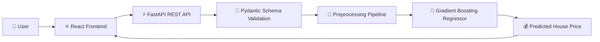
```mermaid
flowchart LR

A["👤 User"]

B["⚛️ React Frontend"]

C["⚡ FastAPI REST API"]

D["📄 Pydantic Schema Validation"]

E["🧹 Preprocessing Pipeline"]

F["🤖 Gradient Boosting Regressor"]

G["💰 Predicted House Price"]

A --> B
B --> C
C --> D
D --> E
E --> F
F --> G
G --> B
```

---

# 🧩 System Components

The application is divided into multiple independent modules, each responsible for a specific stage of the prediction process.

---

## 👤 User Layer

The user interacts with the application through a modern React-based interface.

Instead of entering every property attribute on a single page, the application provides a structured multi-step prediction wizard that improves usability while reducing input errors.

The frontend is responsible only for collecting information and displaying prediction results. No machine learning computations are performed inside the browser.

---

## ⚛️ Frontend Layer

The frontend is developed using **React 19**, **Vite**, and **Tailwind CSS**.

Its primary responsibilities include:

- Collecting property information
- Client-side form validation
- Managing application state
- Multi-step prediction workflow
- API communication
- Displaying prediction results
- Supporting Dark Mode
- Responsive user interface

After the user submits the form, the frontend sends the collected data to the FastAPI backend using a POST request.

---

## ⚡ Backend Layer

The backend is implemented using **FastAPI**, a modern high-performance web framework designed for building RESTful APIs.

The backend serves as the communication bridge between the frontend and the machine learning model.

Its responsibilities include:

- Receiving prediction requests
- Validating incoming data
- Completing missing optional features
- Executing the preprocessing pipeline
- Running machine learning inference
- Returning JSON responses
- Providing automatic Swagger documentation

Because the backend is independent of the frontend, the prediction API can also be consumed by mobile applications or third-party services without modifying the machine learning code.

---

## 🤖 Machine Learning Layer

The machine learning layer contains all artifacts required during inference.

These include:

- Trained Gradient Boosting Regressor
- Feature column definitions
- Standard Scaler
- Preprocessing metadata
- Default feature configuration

These artifacts are loaded once during backend startup, reducing prediction latency by avoiding repeated disk access during each request.

---

# 🔄 Complete Prediction Workflow

The following diagram illustrates how a prediction request moves through the application.

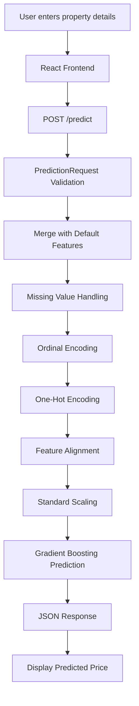
```mermaid
flowchart TD

A["User enters property details"]

B["React Frontend"]

C["POST /predict"]

D["PredictionRequest Validation"]

E["Merge with Default Features"]

F["Missing Value Handling"]

G["Ordinal Encoding"]

H["One-Hot Encoding"]

I["Feature Alignment"]

J["Standard Scaling"]

K["Gradient Boosting Prediction"]

L["JSON Response"]

M["Display Predicted Price"]

A --> B
B --> C
C --> D
D --> E
E --> F
F --> G
G --> H
H --> I
I --> J
J --> K
K --> L
L --> M
```

---

# 📡 Request–Response Lifecycle

Every prediction request follows the same sequence of operations.

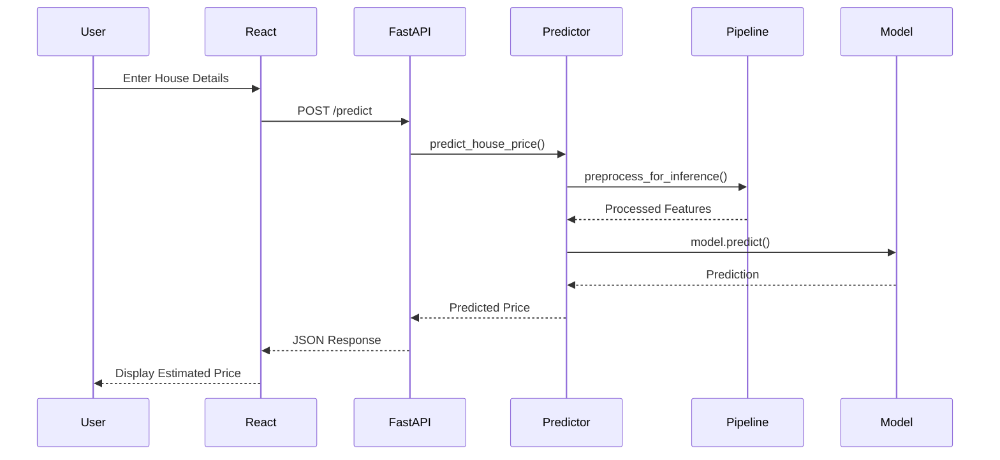
```mermaid
sequenceDiagram

participant User
participant React
participant FastAPI
participant Predictor
participant Pipeline
participant Model

User->>React: Enter House Details

React->>FastAPI: POST /predict

FastAPI->>Predictor: predict_house_price()

Predictor->>Pipeline: preprocess_for_inference()

Pipeline-->>Predictor: Processed Features

Predictor->>Model: model.predict()

Model-->>Predictor: Prediction

Predictor-->>FastAPI: Predicted Price

FastAPI-->>React: JSON Response

React-->>User: Display Estimated Price
```

---

# ⚙️ Backend Architecture

The backend is organized into multiple modules, each responsible for a specific aspect of the application.

This layered organization improves readability while making future maintenance significantly easier.

---

## 📄 app.py

The application entry point.

Responsibilities:

- Creates the FastAPI application.
- Registers all API routes.
- Configures Cross-Origin Resource Sharing (CORS).
- Initializes backend services.
- Exposes automatic Swagger API documentation.
- Provides the root endpoint used to verify that the API is running successfully.

---

## 🌐 api/routes.py

Defines the REST API endpoints.

Current endpoints include:

### GET /

Returns a simple confirmation message indicating that the backend service is running successfully.

---

### GET /health

Health-check endpoint used to verify API availability.

Typical Response:

```json
{
    "status": "API Working"
}
```

This endpoint is useful during deployment and monitoring.

---

### POST /predict

Receives property information from the frontend.

Workflow:

1. Validate incoming request using Pydantic.
2. Forward validated data to the prediction service.
3. Execute preprocessing pipeline.
4. Perform model inference.
5. Return the predicted house price as a JSON response.

Typical Response:

```json
{
    "Predicted Price": 208945.37
}
```

---

## 📋 schemas/prediction.py

This module defines the **PredictionRequest** schema using Pydantic.

The schema ensures that every incoming prediction request:

- Contains valid data types
- Uses consistent field names
- Prevents malformed requests
- Simplifies request parsing

Using schema validation significantly reduces runtime errors and improves API reliability.

---

## 🧠 services/predictor.py

This module contains the core inference engine of the application.

When the backend starts, the prediction service loads all serialized machine learning artifacts into memory.

These include:

- Gradient Boosting model
- Standard Scaler
- Feature columns
- Preprocessing metadata

Loading these resources only once minimizes prediction latency and avoids repeated disk operations.

When a prediction request arrives, the service performs the following operations:

1. Merge user inputs with predefined default feature values.
2. Convert the data into a Pandas DataFrame.
3. Execute the preprocessing pipeline.
4. Validate feature consistency.
5. Generate prediction using the trained model.
6. Return the predicted house price.

---

## 🧹 utils/preprocessing_pipeline.py

The preprocessing pipeline ensures that inference follows exactly the same transformations used during model training.

The pipeline performs:

- Missing value handling
- Ordinal encoding
- One-hot encoding
- Feature alignment
- Numerical feature scaling
- Final feature validation

Using the identical preprocessing pipeline for both training and inference guarantees consistency between the model development environment and the deployed application.

---

## ⚙️ config/default_features.py

Some input attributes may not always be supplied during prediction.

This module stores predefined default feature values, allowing the backend to construct a complete feature vector before preprocessing begins.

This design increases robustness while reducing the likelihood of missing-feature errors.

---

## ⚙️ config/settings.py

Stores backend configuration information used throughout the application.

Keeping configuration separate from business logic improves maintainability and simplifies future deployment.

---

# 📂 Project Structure

```text
Smart-House-Price-Prediction/
│
├── backend/
│   │
│   ├── api/
│   │   └── routes.py
│   │
│   ├── config/
│   │   ├── default_features.py
│   │   └── settings.py
│   │
│   ├── schemas/
│   │   └── prediction.py
│   │
│   ├── services/
│   │   └── predictor.py
│   │
│   ├── utils/
│   │   └── preprocessing_pipeline.py
│   │
│   └── app.py
│
├── data/
│   ├── raw/
│   └── processed/
│
├── evaluation/
│
├── frontend/
│
├── images/
│
├── models/
│   ├── gradient_boosting_tuned.pkl
│   ├── standard_scaler.pkl
│   ├── feature_columns.pkl
│   └── preprocessing_metadata.pkl
│
├── notebooks/
│
├── tests/
│
├── requirements.txt
├── README.md
├── LICENSE
└── .gitignore
```

---

# 📁 Directory Description

| Directory | Description |
|------------|-------------|
| **backend/** | Contains the complete FastAPI backend responsible for request handling, preprocessing, prediction, configuration, and API management. |
| **backend/api/** | Defines all REST API endpoints including health monitoring and prediction services. |
| **backend/config/** | Stores project configuration files, application settings, and predefined default feature values used during inference. |
| **backend/schemas/** | Contains Pydantic models used to validate incoming prediction requests before processing. |
| **backend/services/** | Implements the prediction engine responsible for loading machine learning artifacts, executing preprocessing, validating features, and generating predictions. |
| **backend/utils/** | Contains reusable utility modules including the complete preprocessing pipeline used during inference. |
| **data/** | Stores the original Ames Housing dataset and processed datasets generated during preprocessing. |
| **evaluation/** | Contains model evaluation plots, performance visualizations, regression analysis, and comparison graphs. |
| **frontend/** | React + Vite + Tailwind CSS application responsible for collecting user input and displaying prediction results. |
| **images/** | Stores screenshots, architecture diagrams, and images referenced throughout the documentation. |
| **models/** | Stores serialized machine learning artifacts including the trained model, scaler, feature definitions, and preprocessing metadata. |
| **notebooks/** | Jupyter notebooks documenting each stage of the machine learning workflow from EDA to deployment preparation. |
| **tests/** | Contains testing scripts used to validate different components of the application before deployment. |

---

# 🛠️ Technology Stack

The Smart House Price Prediction System combines modern machine learning libraries, backend technologies, and frontend frameworks to create a complete end-to-end prediction platform.

Each technology was selected based on its reliability, performance, ease of integration, and suitability for production-oriented machine learning applications.

---

## 💻 Programming Languages

| Technology | Purpose |
|------------|---------|
| **Python 3.12** | Machine Learning, Data Processing, Backend Development |
| **JavaScript (ES6+)** | Frontend Development |

---

## 🤖 Machine Learning

| Library | Purpose |
|----------|---------|
| **Scikit-Learn** | Model training, evaluation, preprocessing, hyperparameter tuning |
| **Pandas** | Data manipulation and preprocessing |
| **NumPy** | Numerical computation |
| **Joblib** | Model serialization and loading |

---

## 📊 Data Visualization

| Library | Purpose |
|----------|---------|
| **Matplotlib** | Data visualization and evaluation graphs |

---

## ⚡ Backend Development

| Technology | Purpose |
|------------|---------|
| **FastAPI** | REST API Development |
| **Pydantic** | Request validation and schema enforcement |
| **Uvicorn** | ASGI server for FastAPI |

---

## 🎨 Frontend Development

| Technology | Purpose |
|------------|---------|
| **React 19** | Component-based user interface |
| **Vite** | Fast frontend build tool |
| **Tailwind CSS** | Responsive UI styling |
| **Axios** | Backend API communication |
| **React Hook Form** | Form state management and validation |

---

## 🛠 Development Tools

| Tool | Purpose |
|------|---------|
| **Jupyter Notebook** | Model development |
| **VS Code** | Code development |
| **Git** | Version Control |
| **GitHub** | Repository Management |

---

# 📊 Dataset Description

The project uses the **Ames Housing Dataset**, one of the most widely used regression datasets for predicting residential property prices.

Unlike simple datasets that contain only a few numerical attributes, the Ames Housing dataset provides detailed information describing residential properties from multiple perspectives, allowing machine learning models to learn complex relationships between property characteristics and market prices.

---

## Dataset Overview

| Property | Value |
|-----------|------|
| Dataset Name | Ames Housing Dataset |
| Problem Type | Supervised Regression |
| Number of Samples | 1460 |
| Numerical Features | 38 |
| Categorical Features | 43 |
| Total Features | 81 |
| Target Variable | SalePrice |

---

## Information Available in the Dataset

The dataset contains comprehensive information describing residential properties, including:

- Overall Construction Quality
- Living Area
- Basement Characteristics
- Garage Information
- Exterior Features
- Lot Dimensions
- Property Age
- Neighborhood
- Number of Rooms
- Kitchen Quality
- Heating Quality
- Fireplace Details
- Pool Information
- Sale Conditions

These diverse features enable the machine learning model to estimate house prices with high predictive accuracy.

---

# 🧹 Data Preprocessing Pipeline

High-quality preprocessing is one of the most important stages of any machine learning project.

Real-world datasets often contain missing values, inconsistent categories, mixed data types, and other issues that negatively affect model performance.

To address these challenges, this project implements a reusable preprocessing pipeline that applies exactly the same transformations during both training and prediction.

This guarantees that the deployed model receives data in the same format used during training, ensuring prediction consistency.

---

## Complete Preprocessing Workflow

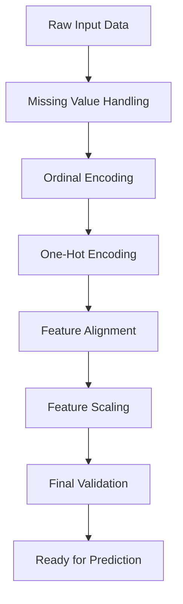
```mermaid
flowchart TD

A["Raw Input Data"]

B["Missing Value Handling"]

C["Ordinal Encoding"]

D["One-Hot Encoding"]

E["Feature Alignment"]

F["Feature Scaling"]

G["Final Validation"]

H["Ready for Prediction"]

A --> B
B --> C
C --> D
D --> E
E --> F
F --> G
G --> H
```

---

# 📌 Step 1 — Missing Value Handling

Missing values are handled using feature-specific strategies rather than applying a single imputation method to every column.

Different variables require different treatments depending on their semantic meaning.

### Categorical Features

Several categorical columns represent the absence of a particular feature rather than missing information.

Examples include:

- PoolQC
- Fence
- Alley
- FireplaceQu
- GarageType
- GarageFinish
- GarageQual
- GarageCond
- Basement Quality
- Basement Exposure
- Masonry Veneer Type

These features are replaced with:

```
"None"
```

instead of statistical imputation.

This preserves the actual meaning of the data.

---

### Numerical Features

Different numerical columns use different imputation strategies.

| Feature | Strategy |
|----------|----------|
| LotFrontage | Median Value |
| MasVnrArea | Zero |
| GarageYrBlt | Zero |
| Electrical | Mode |

These strategies were selected based on the statistical characteristics of each feature during exploratory data analysis.

---

# 📌 Step 2 — Ordinal Encoding

Some categorical variables possess an inherent ordering.

Examples include:

- ExterQual
- KitchenQual
- HeatingQC
- FireplaceQu
- GarageQual
- GarageCond
- PoolQC

Instead of one-hot encoding these features, they are transformed into ordered numerical values while preserving their ranking.

For example:

| Category | Encoded Value |
|-----------|--------------|
| None | 0 |
| Poor | 1 |
| Fair | 2 |
| Typical | 3 |
| Good | 4 |
| Excellent | 5 |

Before encoding begins, the preprocessing pipeline verifies that every category appearing in the input data exists within the predefined mapping.

Unexpected category values immediately trigger validation errors, preventing invalid predictions.

---

# 📌 Step 3 — Nominal Encoding

Unlike ordinal variables, nominal categorical features do not possess any natural ordering.

Examples include:

- Neighborhood
- Exterior Material
- Roof Style
- Sale Type
- Foundation
- House Style

These variables are transformed using **One-Hot Encoding**.

The preprocessing pipeline automatically:

- Detects nominal features
- Creates binary indicator columns
- Prevents duplicate columns
- Validates missing values after encoding

This transformation allows machine learning algorithms to process categorical information without introducing artificial ordering.

---

# 📌 Step 4 — Feature Alignment

One common challenge during deployment is ensuring that prediction inputs exactly match the feature space used during training.

After encoding, the preprocessing pipeline compares the generated features with the feature list saved during model training.

If any expected feature is missing, it is automatically created with a default value of zero.

Finally, the feature order is restored to exactly match the order expected by the trained Gradient Boosting model.

This guarantees complete compatibility between training and inference.

---

# 📌 Step 5 — Feature Scaling

Continuous numerical features are standardized using the **StandardScaler** fitted during model training.

Rather than fitting a new scaler during inference, the preprocessing pipeline loads the previously trained scaler from disk.

Only the numerical features selected during training are transformed.

Binary variables, excluded columns, and constant features remain unchanged.

This ensures that prediction data follows the same statistical distribution as the training data.

---

# 📌 Step 6 — Validation

Before the processed data is passed to the machine learning model, several validation checks are performed.

These include:

- Missing value detection
- Unexpected categories
- Duplicate feature detection
- Infinite value detection
- Feature count verification
- Column ordering validation
- Scaled feature validation

Performing these checks before prediction significantly improves the robustness and reliability of the deployed application.

---

# ⚙️ Feature Engineering

Feature engineering transforms raw housing information into a representation that is more suitable for machine learning algorithms.

The project combines domain knowledge with statistical preprocessing techniques to maximize predictive performance.

The feature engineering pipeline includes:

- Missing value imputation
- Ordinal feature transformation
- Nominal feature encoding
- Numerical standardization
- Feature alignment
- Removal of inconsistencies

These transformations ensure that every prediction request is converted into a clean numerical feature vector before reaching the trained regression model.

---

# 🎯 Why This Preprocessing Pipeline?

One of the most common mistakes in machine learning deployment is applying different preprocessing steps during training and prediction.

This project eliminates that risk by using a dedicated inference preprocessing pipeline that mirrors the transformations performed during model development.

As a result:

- Training and inference remain fully consistent.
- Prediction errors caused by feature mismatch are eliminated.
- Model inputs remain standardized.
- Deployment becomes significantly more reliable.
- Future model updates can reuse the same preprocessing pipeline without modifying the frontend or API.

This design follows best practices commonly adopted in production machine learning systems where reproducibility and consistency are essential.

---

# 🤖 Machine Learning Models

Selecting an appropriate machine learning algorithm is one of the most important stages of any predictive analytics project.

Instead of directly choosing a single model, multiple regression algorithms were trained, evaluated, and compared using identical preprocessing steps and evaluation metrics.

This systematic approach ensured that the final deployed model was selected based on objective performance rather than assumptions.

Each model was trained using the same processed dataset, allowing a fair comparison of predictive accuracy, robustness, and generalization capability.

---

# 🎯 Model Development Strategy

The overall model development process followed the workflow illustrated below.

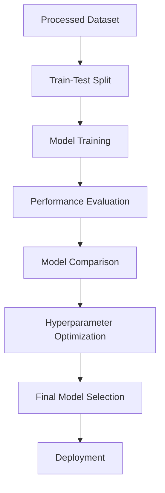
```mermaid
flowchart TD

A["Processed Dataset"]

B["Train-Test Split"]

C["Model Training"]

D["Performance Evaluation"]

E["Model Comparison"]

F["Hyperparameter Optimization"]

G["Final Model Selection"]

H["Deployment"]

A --> B
B --> C
C --> D
D --> E
E --> F
F --> G
G --> H
```

---

# 📚 Regression Models Evaluated

Multiple supervised regression algorithms were implemented and compared.

Each algorithm offers different advantages in terms of complexity, interpretability, computational efficiency, and predictive capability.

---

## 📈 Linear Regression

Linear Regression was used as the baseline model.

### Characteristics

- Simple mathematical model
- Highly interpretable
- Fast training
- Easy to understand

### Advantages

- Computationally efficient
- Serves as a strong baseline
- Easy to explain

### Limitations

- Assumes linear relationships
- Sensitive to multicollinearity
- Limited ability to capture complex interactions

---

## 📈 Ridge Regression

Ridge Regression extends Linear Regression by introducing **L2 Regularization**.

### Advantages

- Reduces overfitting
- Handles correlated features
- Produces more stable coefficients

### Limitations

- Still assumes linear relationships
- Less flexible than ensemble models

---

## 📈 Lasso Regression

Lasso Regression introduces **L1 Regularization**, encouraging sparse solutions.

### Advantages

- Performs automatic feature selection
- Reduces model complexity
- Improves interpretability

### Limitations

- May remove useful features
- Limited ability to model nonlinear relationships

---

## 🌳 Random Forest Regressor

Random Forest is an ensemble learning algorithm based on multiple decision trees.

Instead of relying on a single tree, the algorithm combines predictions from numerous trees to improve stability and reduce variance.

### Advantages

- Handles nonlinear relationships
- Resistant to overfitting
- Works well with mixed feature types
- Captures complex interactions

### Limitations

- Larger memory usage
- Less interpretable
- Slower inference compared to linear models

---

## 🚀 Gradient Boosting Regressor

Gradient Boosting is a boosting-based ensemble learning algorithm that builds trees sequentially.

Each new tree attempts to correct the prediction errors made by previous trees.

Rather than averaging independent trees, Gradient Boosting gradually improves the model by minimizing prediction error at each iteration.

### Advantages

- Excellent predictive accuracy
- Handles nonlinear feature relationships
- Learns complex interactions
- Robust against moderate noise
- Strong generalization performance

Because of these characteristics, Gradient Boosting achieved the highest predictive performance among all evaluated models and was selected as the final deployment model.

---

# ⚙️ Hyperparameter Optimization

Although Gradient Boosting already demonstrated superior performance, additional optimization was performed using **GridSearchCV**.

Rather than relying on default hyperparameters, multiple parameter combinations were evaluated through exhaustive search.

The objective was to identify the configuration that produced the highest cross-validation performance while minimizing overfitting.

---

## Optimization Workflow


```mermaid
flowchart LR

A["Gradient Boosting"]

B["Parameter Grid"]

C["GridSearchCV"]

D["5-Fold Cross Validation"]

E["Best Parameters"]

F["Final Optimized Model"]

A --> B
B --> C
C --> D
D --> E
E --> F
```

---

## Best Hyperparameters

| Hyperparameter | Selected Value |
|---------------|---------------:|
| Learning Rate | **0.05** |
| Number of Estimators | **300** |
| Maximum Depth | **5** |
| Subsample | **0.80** |

The optimized model demonstrated better predictive performance and improved generalization compared to the default configuration.

---

# 📊 Model Evaluation

To comprehensively evaluate regression performance, multiple statistical metrics were used.

Each metric provides a different perspective on model quality.

---

## Coefficient of Determination (R² Score)

The R² Score measures the proportion of variance in house prices explained by the model.

Higher values indicate better predictive performance.

---

## Mean Absolute Error (MAE)

MAE calculates the average absolute difference between predicted and actual prices.

Lower MAE values indicate more accurate predictions.

---

## Mean Squared Error (MSE)

MSE measures the average squared prediction error.

Large prediction errors receive greater penalties than smaller ones.

---

## Root Mean Squared Error (RMSE)

RMSE is the square root of MSE.

Because it uses the same units as the target variable, it is easier to interpret than MSE.

---

## Cross Validation

Cross-validation evaluates model performance across multiple train-test splits.

Rather than depending on a single random split, the model is trained and validated several times to estimate its ability to generalize to unseen data.

This project uses **5-Fold Cross Validation** during hyperparameter optimization.

---

# 🏆 Final Model Performance

After comparing multiple regression algorithms and performing hyperparameter optimization, the **Gradient Boosting Regressor** was selected as the final deployment model.

---

## 📈 Performance Metrics

| Metric | Value |
|---------|------:|
| **R² Score** | **0.9140** |
| **Cross Validation Mean** | **0.8761** |
| **Cross Validation Standard Deviation** | **0.0448** |
| **Mean Absolute Error (MAE)** | **15,737.35** |
| **Mean Squared Error (MSE)** | **659,500,022.11** |
| **Root Mean Squared Error (RMSE)** | **25,680.73** |
| **Training Time** | **4.22 seconds** |
| **Prediction Time** | **0.019 seconds** |

---

# 📌 Performance Interpretation

The tuned Gradient Boosting Regressor achieved an **R² Score of 0.9140**, indicating that the model explains approximately **91.4%** of the variability in residential house prices.

The **Cross Validation Mean Score of 0.8761** demonstrates that the model maintains strong predictive performance across different subsets of the dataset.

A relatively low **Cross Validation Standard Deviation (0.0448)** suggests that the model is stable and does not exhibit significant performance fluctuations between folds.

The obtained **Mean Absolute Error (15,737.35)** indicates that, on average, the model's predictions remain reasonably close to the actual selling prices.

The low **RMSE** further confirms that large prediction errors are relatively uncommon, reflecting the model's ability to generalize effectively to unseen data.

Overall, these evaluation metrics demonstrate that the selected model provides an excellent balance between prediction accuracy, robustness, and generalization.

---

# 🧠 Why Gradient Boosting Was Selected

Among all evaluated regression algorithms, Gradient Boosting consistently achieved the highest predictive performance.

Several factors contributed to its superior results:

- Ability to model complex nonlinear relationships.
- Sequential error correction improves prediction accuracy.
- Strong resistance to moderate overfitting.
- Effective handling of mixed numerical and categorical features after preprocessing.
- Excellent balance between bias and variance.
- Stable cross-validation performance.
- Fast prediction time suitable for real-time inference.

These characteristics made Gradient Boosting the most suitable choice for deployment in the Smart House Price Prediction System.

---

# 🎯 Model Deployment Readiness

Before deployment, the trained model and all required preprocessing artifacts were serialized using **Joblib**.

The following artifacts are loaded by the FastAPI backend during application startup:

- Tuned Gradient Boosting Regressor
- StandardScaler
- Feature Columns
- Preprocessing Metadata

Loading these artifacts only once significantly reduces prediction latency and ensures that every incoming request follows the same preprocessing and inference pipeline used during model development.

This design guarantees consistency, reproducibility, and efficient real-time predictions.

---

# 📊 Model Evaluation and Performance Analysis

Developing a high-performing machine learning model requires more than achieving a high accuracy score. A comprehensive evaluation must verify that the model generalizes well, produces reliable predictions, and does not exhibit systematic bias.

To thoroughly assess the performance of the trained **Gradient Boosting Regressor**, multiple statistical metrics and visualization techniques were employed.

These analyses help validate the predictive capability of the model while providing insights into its strengths and potential limitations.

---

# 📈 Evaluation Workflow

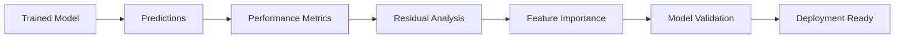
```mermaid
flowchart LR

A["Trained Model"]

B["Predictions"]

C["Performance Metrics"]

D["Residual Analysis"]

E["Feature Importance"]

F["Model Validation"]

G["Deployment Ready"]

A --> B
B --> C
C --> D
D --> E
E --> F
F --> G
```

---

# 🎯 Evaluation Objectives

The evaluation process aims to answer several important questions:

- How accurately does the model predict house prices?
- Does the model generalize well to unseen data?
- Are prediction errors randomly distributed?
- Which features contribute the most to predictions?
- Is the model suitable for deployment?

Answering these questions helps determine whether the trained model is reliable enough for real-world prediction tasks.

---

# 📊 Actual vs Predicted Prices

The **Actual vs Predicted** plot compares the selling prices predicted by the model with the true house prices in the test dataset.

<p align="center">
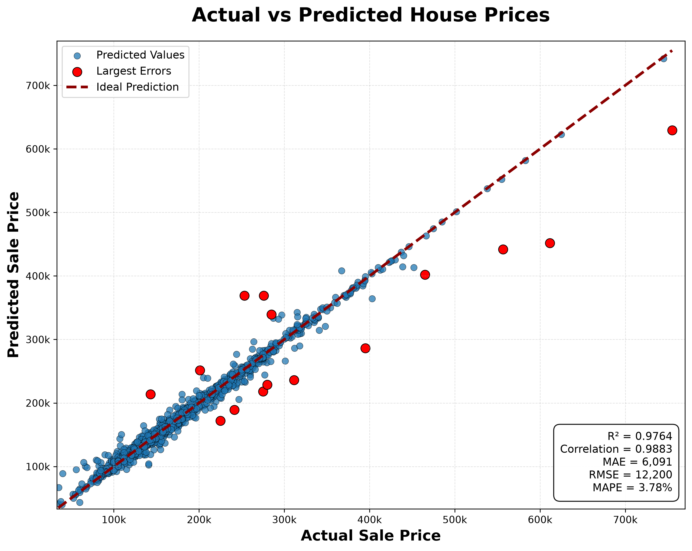
</p>

### Interpretation

- Each point represents one property.
- The diagonal line represents perfect predictions.
- Points closer to the diagonal indicate higher prediction accuracy.

### Observations

- Most predictions closely follow the reference line.
- Only a small number of properties exhibit noticeable prediction errors.
- No significant systematic deviation is observed.

### Conclusion

The close alignment between actual and predicted values indicates that the model successfully captures the relationship between housing features and selling prices.

---

# 📉 Residual Distribution

Residuals represent the difference between the actual selling price and the predicted selling price.

Analyzing residuals helps determine whether prediction errors occur randomly or follow an undesirable pattern.

<p align="center">
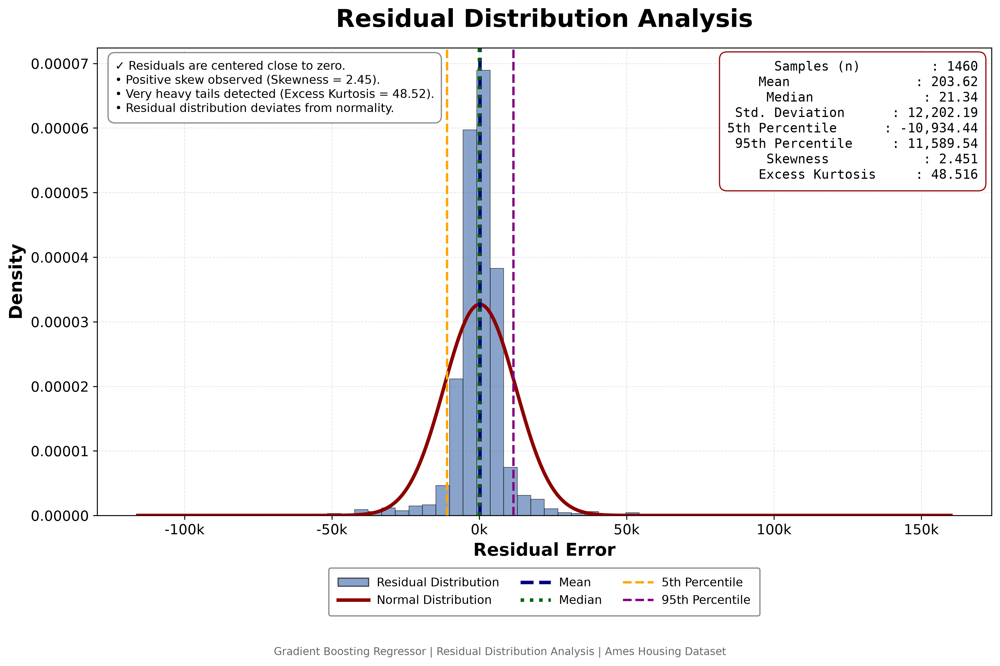
</p>

### Interpretation

A well-performing regression model should produce residuals centered around zero.

### Observations

- Residuals are approximately symmetric.
- Most prediction errors are concentrated near zero.
- Extreme residuals are relatively uncommon.

### Conclusion

The residual distribution suggests that the model does not consistently overestimate or underestimate house prices.

---

# 📍 Residuals vs Predicted Values

This visualization compares prediction errors against predicted prices.

<p align="center">
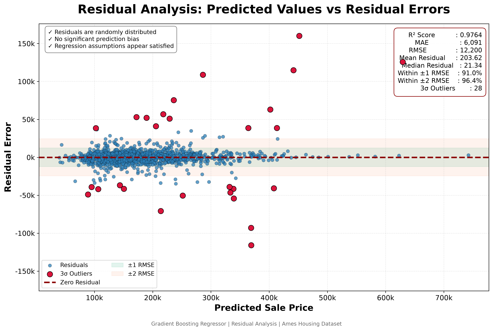
</p>

### Interpretation

Ideally, residuals should appear randomly scattered around zero.

Random scatter indicates:

- Constant prediction variance
- Stable model behavior
- No systematic prediction bias

### Observations

- Residuals appear randomly distributed.
- No obvious trend or curve is visible.
- Variance remains relatively stable.

### Conclusion

The absence of visible patterns indicates that the regression model satisfies important assumptions and generalizes well.

---

# 📊 Feature Importance

Feature Importance measures the contribution of each feature to the final prediction.

Unlike simple linear models, Gradient Boosting automatically learns which variables provide the greatest predictive value.

<p align="center">
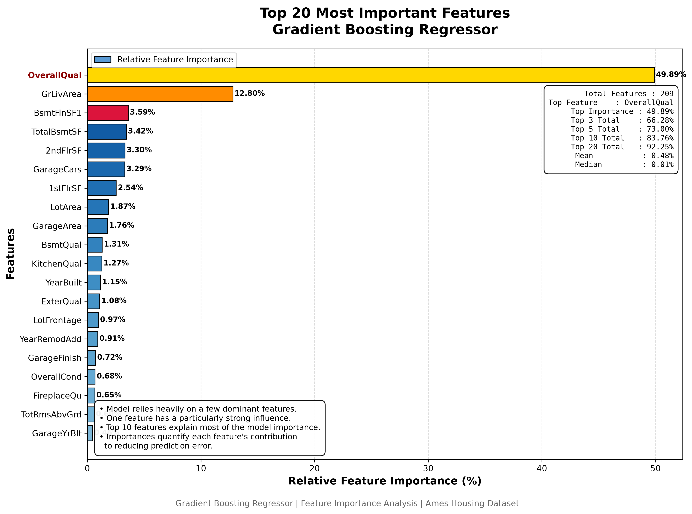
</p>

### Interpretation

Higher importance values indicate that a feature contributes more strongly to prediction accuracy.

### Key Findings

Typical high-impact features include:

- Overall Quality
- Ground Living Area
- Garage Capacity
- Basement Area
- Year Built

### Conclusion

The identified important features align well with domain knowledge of residential property valuation, increasing confidence in the model.

---

# 🔍 Permutation Feature Importance

Permutation Importance evaluates feature importance by measuring the decrease in model performance after randomly shuffling each feature.

Unlike tree-based importance scores, permutation importance provides a model-agnostic assessment.

<p align="center">
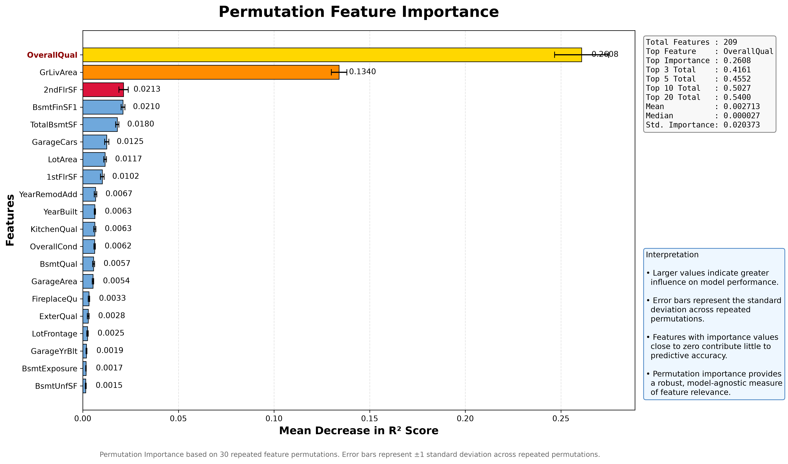
</p>

### Interpretation

If randomly shuffling a feature causes a significant drop in prediction accuracy, that feature is considered highly important.

### Advantages

- Model-independent
- More robust than built-in feature importance
- Reduces interpretation bias

### Conclusion

Permutation Importance confirms that the same core housing attributes remain the strongest predictors of selling price.

---

# 📐 Q-Q Plot

The Quantile-Quantile (Q-Q) Plot compares the distribution of residuals with a theoretical normal distribution.

<p align="center">
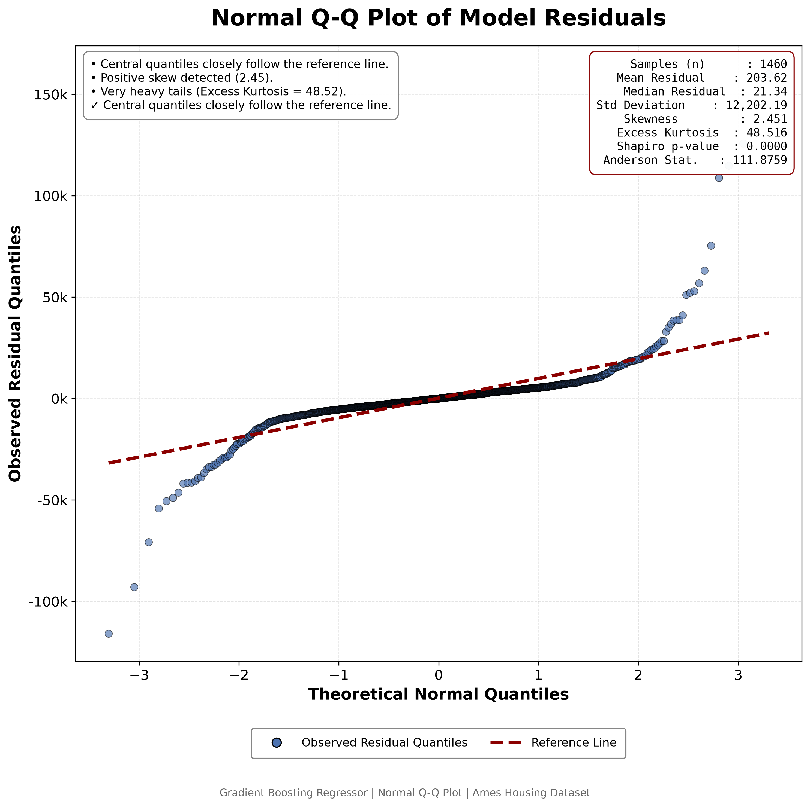
</p>

### Interpretation

Residuals following the reference line indicate approximate normality.

### Observations

- Most residuals closely follow the theoretical line.
- Small deviations occur at the distribution tails.
- Extreme observations are limited.

### Conclusion

The residuals exhibit an approximately normal distribution, supporting the overall reliability of the regression model.

---

# 📋 Overall Performance Summary

The combined evaluation demonstrates that the model performs consistently across multiple statistical perspectives.

| Evaluation Aspect | Result |
|-------------------|--------|
| Prediction Accuracy | Excellent |
| Generalization | Strong |
| Residual Behavior | Random |
| Feature Importance | Meaningful |
| Model Stability | High |
| Prediction Consistency | Excellent |
| Deployment Readiness | Verified |

---

# 🎯 Strengths of the Final Model

The tuned Gradient Boosting Regressor demonstrates several important strengths:

- High predictive accuracy
- Stable cross-validation performance
- Strong generalization capability
- Low prediction error
- Effective handling of nonlinear relationships
- Robust feature learning
- Fast inference time
- Suitable for real-time deployment

These characteristics make the model well suited for integration into a production-oriented prediction system.

---

# ✅ Final Evaluation

Based on quantitative metrics, visual analysis, and validation experiments, the **Gradient Boosting Regressor** was selected as the final deployment model.

The evaluation confirms that the model:

- Explains approximately **91.4%** of the variance in house prices.
- Produces reliable predictions across diverse property types.
- Maintains stable performance during cross-validation.
- Demonstrates well-behaved residual characteristics.
- Successfully captures the complex relationships between housing features and market value.

Overall, the model achieves an effective balance between predictive accuracy, robustness, computational efficiency, and deployment readiness, making it a suitable choice for real-world house price prediction applications.

---

# 🖥️ Frontend Architecture

The frontend of the Smart House Price Prediction System is developed using **React 19**, **Vite**, and **Tailwind CSS**, providing a modern, responsive, and user-friendly interface for real-time house price prediction.

Unlike traditional HTML forms, the application uses a component-based architecture that separates UI elements into reusable and maintainable modules.

The frontend communicates exclusively with the FastAPI backend through REST API calls, ensuring a clean separation between presentation and business logic.

---

## 🎯 Frontend Features

The frontend provides the following functionality:

- Responsive user interface
- Modern landing page
- Multi-step prediction wizard
- Interactive form validation
- Review page before prediction
- Real-time API integration
- Dark Mode support
- Smooth navigation between steps
- Clean and intuitive user experience

---

## 🏛️ Frontend Architecture

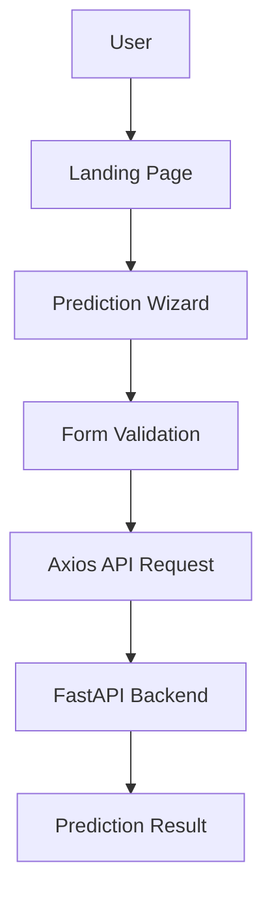
```mermaid
flowchart TD

A["User"]

B["Landing Page"]

C["Prediction Wizard"]

D["Form Validation"]

E["Axios API Request"]

F["FastAPI Backend"]

G["Prediction Result"]

A --> B
B --> C
C --> D
D --> E
E --> F
F --> G
```

---

## 📋 Prediction Workflow

The frontend prediction process consists of the following stages:

1. User enters property details.

2. Input data is validated.

3. User reviews all information before submission.

4. Frontend sends a POST request to the backend.

5. Backend processes the request.

6. Predicted house price is returned.

7. Frontend displays the estimated selling price.

---

# ⚡ Backend Architecture

The backend is implemented using **FastAPI**, providing a lightweight, high-performance REST API for machine learning inference.

The backend is responsible for connecting the frontend with the trained machine learning model while ensuring that all incoming requests are validated and processed correctly.

Unlike monolithic applications, the backend follows a modular architecture where routing, prediction logic, configuration, preprocessing, and schemas are organized into independent modules.

---

## Backend Responsibilities

The backend performs the following operations:

- Receives API requests
- Validates incoming data
- Loads trained machine learning artifacts
- Applies preprocessing pipeline
- Performs model inference
- Returns prediction response
- Handles API documentation
- Supports Cross-Origin Resource Sharing (CORS)

---

## Backend Module Organization

```text
backend/
│
├── api/
│     └── routes.py
│
├── config/
│     ├── default_features.py
│     └── settings.py
│
├── schemas/
│     └── prediction.py
│
├── services/
│     └── predictor.py
│
├── utils/
│     └── preprocessing_pipeline.py
│
└── app.py
```

---

# 🔄 End-to-End Prediction Pipeline

The following diagram illustrates the complete lifecycle of a prediction request.

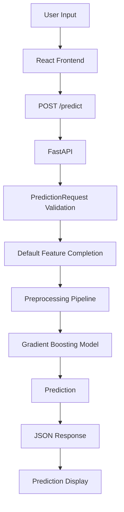
```mermaid
flowchart TD

A["User Input"]

B["React Frontend"]

C["POST /predict"]

D["FastAPI"]

E["PredictionRequest Validation"]

F["Default Feature Completion"]

G["Preprocessing Pipeline"]

H["Gradient Boosting Model"]

I["Prediction"]

J["JSON Response"]

K["Prediction Display"]

A --> B
B --> C
C --> D
D --> E
E --> F
F --> G
G --> H
H --> I
I --> J
J --> K
```

---

## Detailed Prediction Pipeline

Every prediction follows the same sequence of operations.

### Step 1

The user enters the property information using the React application.

---

### Step 2

The frontend sends the collected information to the FastAPI backend through the **POST /predict** endpoint.

---

### Step 3

FastAPI validates the request using the **PredictionRequest** Pydantic schema.

Invalid requests are rejected before reaching the prediction service.

---

### Step 4

The prediction service combines user-provided values with predefined default feature values to ensure that every feature expected by the trained model is available.

---

### Step 5

The preprocessing pipeline transforms the input using the same operations employed during model training.

These transformations include:

- Missing value handling
- Ordinal encoding
- One-Hot encoding
- Feature alignment
- Numerical scaling

---

### Step 6

The processed feature vector is passed to the trained **Gradient Boosting Regressor**.

The model generates the estimated house price.

---

### Step 7

The prediction is returned as a JSON response to the frontend.

---

### Step 8

The frontend displays the estimated selling price to the user in an easy-to-read format.

---

# 🌐 REST API Documentation

The backend exposes RESTful endpoints developed using FastAPI.

---

## Base URL

```
http://127.0.0.1:8000
```

---

## Root Endpoint

### Request

```http
GET /
```

### Response

```json
{
    "message": "Smart House Price Prediction API is running successfully!"
}
```

---

## Health Check

### Request

```http
GET /health
```

### Response

```json
{
    "status": "API Working"
}
```

This endpoint can be used to verify that the backend service is available.

---

## Predict House Price

### Request

```http
POST /predict
```

---

### Example Request

```json
{
  "OverallQual": 7,
  "GrLivArea": 1710,
  "GarageCars": 2,
  "GarageArea": 548,
  "TotalBsmtSF": 856,
  "FullBath": 2,
  "YearBuilt": 2003,
  "YearRemodAdd": 2003
}
```

---

### Example Response

```json
{
    "Predicted Price": 208945.37
}
```

---

# 📚 Interactive API Documentation

FastAPI automatically generates OpenAPI-compliant interactive documentation.

After starting the backend server, open:

```
http://127.0.0.1:8000/docs
```

The Swagger interface allows developers to:

- Test API endpoints
- Inspect request schemas
- View response models
- Validate API functionality
- Explore endpoint documentation

---

# 🚀 Installation Guide

## Clone Repository

```bash
git clone https://github.com/Vedansh1011/Smart-House-Price-Prediction.git

cd Smart-House-Price-Prediction
```

---

# ⚙️ Backend Setup

## Create Virtual Environment

### Windows

```bash
python -m venv venv

venv\Scripts\activate
```

### Linux / macOS

```bash
python3 -m venv venv

source venv/bin/activate
```

---

## Install Dependencies

```bash
pip install -r requirements.txt
```

---

## Run Backend

```bash
uvicorn backend.app:app --reload
```

The backend server starts on:

```
http://127.0.0.1:8000
```

---

# 💻 Frontend Setup

Navigate to the frontend directory.

```bash
cd frontend
```

Install project dependencies.

```bash
npm install
```

Run the development server.

```bash
npm run dev
```

The frontend launches automatically in your browser.

---

# 📂 Project Execution

Start the backend server first.

```bash
uvicorn backend.app:app --reload
```

Then start the frontend.

```bash
cd frontend

npm run dev
```

Open the frontend in your browser and begin predicting residential property prices.

---

# ☁️ Deployment

The project is designed for cloud deployment using separate frontend and backend hosting services.

---

## Frontend Deployment

Recommended Platform:

- **Vercel**

Deployment Features:

- Continuous Deployment
- Automatic HTTPS
- Fast Global CDN
- React Optimization

---

## Backend Deployment

Recommended Platform:

- **Render**

Deployment Features:

- FastAPI Support
- Automatic Build Process
- Public REST API
- Swagger Documentation
- Environment Variable Support

---

## Production Deployment Workflow

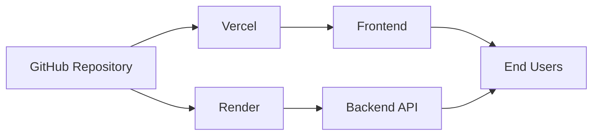
```mermaid
flowchart LR

A["GitHub Repository"]

B["Vercel"]

C["Render"]

D["Frontend"]

E["Backend API"]

F["End Users"]

A --> B
A --> C

B --> D
C --> E

D --> F
E --> F
```

---

# 📸 Application Screenshots

The following screenshots demonstrate different components of the application.

---

## 🏠 Landing Page

> **Add Screenshot**

```text
images/landing_page.png
```

---

## ℹ️ About Section

> **Add Screenshot**

```text
images/about_section.png
```

---

## 📝 Prediction Wizard

> **Add Screenshot**

```text
images/prediction_wizard.png
```

---

## ✅ Review Page

> **Add Screenshot**

```text
images/review_page.png
```

---

## 💰 Prediction Result

> **Add Screenshot**

```text
images/prediction_result.png
```

---

## 🌙 Dark Mode

> **Add Screenshot**

```text
images/dark_mode.png
```

---

## 🌐 Swagger Documentation

> **Add Screenshot**

```text
images/swagger_api.png
```

---

## 📱 Responsive Interface

> **Optional Screenshot**

```text
images/mobile_view.png
```

---

# 📌 Summary

The Smart House Price Prediction System combines modern machine learning techniques with a scalable software architecture to deliver accurate and efficient real-time residential property price estimation.

The application demonstrates the complete lifecycle of a production-inspired machine learning solution, including data preprocessing, model training, hyperparameter optimization, backend API development, frontend implementation, and deployment-ready architecture.

By integrating a tuned Gradient Boosting Regressor with FastAPI and a React-based frontend, the system provides an intuitive user experience while maintaining robust prediction performance and software engineering best practices.

This project serves as a strong demonstration of practical machine learning deployment and full-stack AI application development.

---

# 🚀 Future Improvements

Although the Smart House Price Prediction System provides accurate real-time predictions and follows a production-inspired architecture, there are several opportunities for future enhancement.

These improvements would increase scalability, usability, interpretability, and deployment readiness while making the application suitable for larger real-world environments.

---

## 🤖 Machine Learning Enhancements

Future versions of the project may include:

- Support for advanced ensemble learning techniques such as XGBoost, LightGBM, and CatBoost.
- Automated feature selection techniques.
- Automated hyperparameter optimization using Optuna.
- Ensemble model stacking.
- Automated model retraining.
- Incremental learning for newly collected data.
- Advanced outlier detection techniques.
- Time-based model monitoring.

---

## 🧠 Explainable AI (XAI)

Machine learning models often behave as black boxes.

To improve transparency and interpretability, future versions may integrate Explainable AI techniques including:

- SHAP (SHapley Additive Explanations)
- LIME (Local Interpretable Model-Agnostic Explanations)
- Individual prediction explanations
- Global feature importance dashboards
- Interactive explanation visualizations

These techniques would help users understand how each feature contributes to the predicted house price.

---

## 🌐 Backend Improvements

Future backend enhancements include:

- JWT Authentication
- User Management
- Role-Based Access Control (RBAC)
- Prediction History API
- Database Integration
- API Rate Limiting
- Response Caching
- Request Logging
- Background Task Processing
- Model Versioning

---

## 💻 Frontend Improvements

The frontend can be extended with additional features such as:

- User Login and Registration
- Saved Prediction History
- Interactive Price Visualization
- Property Comparison Dashboard
- Data Analytics Dashboard
- User Profile Management
- Accessibility Improvements
- Localization Support
- Progressive Web Application (PWA)

---

## ☁️ Cloud Deployment

Future deployment improvements include:

- Docker Containerization
- Kubernetes Orchestration
- CI/CD Pipeline
- AWS Deployment
- Microsoft Azure Deployment
- Google Cloud Deployment
- Nginx Reverse Proxy
- HTTPS Configuration
- Monitoring using Prometheus and Grafana

---

## 📊 Business Intelligence

Potential analytics features include:

- Prediction Trends
- Market Analysis Dashboard
- Neighborhood Comparison
- Historical Price Analysis
- Regional Price Heatmaps
- Interactive Charts
- Downloadable Reports

---

# 🎯 Learning Outcomes

Developing this project provided practical experience in multiple areas of Artificial Intelligence, Machine Learning, Software Engineering, and Full-Stack Development.

Major learning outcomes include:

- End-to-End Machine Learning Pipeline Development
- Exploratory Data Analysis (EDA)
- Feature Engineering
- Regression Model Development
- Hyperparameter Optimization
- Model Evaluation
- FastAPI Backend Development
- REST API Design
- React Application Development
- Frontend-Backend Integration
- Model Deployment
- Software Architecture
- Version Control using Git and GitHub

This project demonstrates how modern machine learning systems extend beyond model development to include robust software engineering practices.

---

# 💼 Project Highlights

### ✅ End-to-End Machine Learning Pipeline

From raw dataset exploration to production-ready deployment.

---

### ✅ Production-Inspired Architecture

Frontend, backend, preprocessing pipeline, and prediction engine are cleanly separated.

---

### ✅ Real-Time Prediction

Instant house price prediction through REST APIs.

---

### ✅ Modern Frontend

Developed using React, Vite, and Tailwind CSS.

---

### ✅ FastAPI Backend

High-performance backend with automatic API documentation.

---

### ✅ Modular Design

Independent components improve scalability and maintainability.

---

### ✅ Deployment Ready

Designed for cloud deployment using modern deployment platforms.

---

# 🤝 Contributing

Contributions are always welcome.

If you would like to improve this project, please follow these steps:

1. Fork the repository.
2. Create a new feature branch.

```bash
git checkout -b feature/your-feature-name
```

3. Commit your changes.

```bash
git commit -m "Add your feature"
```

4. Push your branch.

```bash
git push origin feature/your-feature-name
```

5. Open a Pull Request.

Please ensure that your code follows the existing project structure and coding standards.

---

# 📄 License

This project is distributed under the **MIT License**.

The MIT License permits the use, modification, and distribution of this software for both personal and commercial purposes, provided that the original copyright notice and license are included.

For additional details, refer to the **LICENSE** file included in this repository.

---

# 👨‍💻 Author

<div align="center">

## Vedansh

**M.Tech – Computer Science & Engineering**

Passionate about building intelligent systems that combine Machine Learning, Artificial Intelligence, and modern Software Engineering.

</div>

---

## 🎓 Areas of Interest

- Artificial Intelligence
- Machine Learning
- Deep Learning
- Computer Vision
- Natural Language Processing
- Large Language Models (LLMs)
- Generative AI
- AI Agents
- Full-Stack AI Applications

---

## 🛠 Technical Skills

### Programming Languages

- Python
- Java
- JavaScript

### Machine Learning

- Scikit-Learn
- Pandas
- NumPy
- Matplotlib

### Backend

- FastAPI
- REST APIs

### Frontend

- React
- Vite
- Tailwind CSS

### Tools

- Git
- GitHub
- VS Code
- Jupyter Notebook

---

## 🌐 GitHub

**Repository**

```text
https://github.com/Vedansh1011/Smart-House-Price-Prediction
```

**Profile**

```text
https://github.com/Vedansh1011
```

---

# ⭐ Support

If you found this project useful, please consider giving it a ⭐ on GitHub.

Your support helps increase the visibility of the project and encourages future development.

If you have suggestions, ideas, or feedback, feel free to open an Issue or submit a Pull Request.

Every contribution, suggestion, or bug report is greatly appreciated.

---

# 🙏 Acknowledgements

This project was inspired by the need to bridge the gap between academic machine learning models and production-ready AI applications.

Special thanks to the developers and maintainers of the following open-source technologies:

- Python
- Scikit-Learn
- FastAPI
- React
- Tailwind CSS
- Vite
- Pandas
- NumPy
- Matplotlib

Their contributions to the open-source community made this project possible.

---

<div align="center">

# 🎉 Thank You for Visiting!

If you enjoyed exploring this project, don't forget to ⭐ the repository.

### Happy Coding! 🚀

</div>